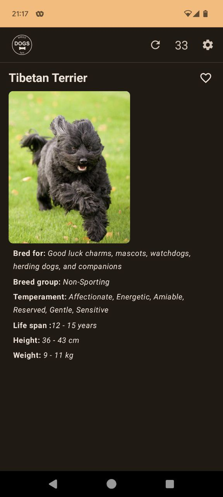
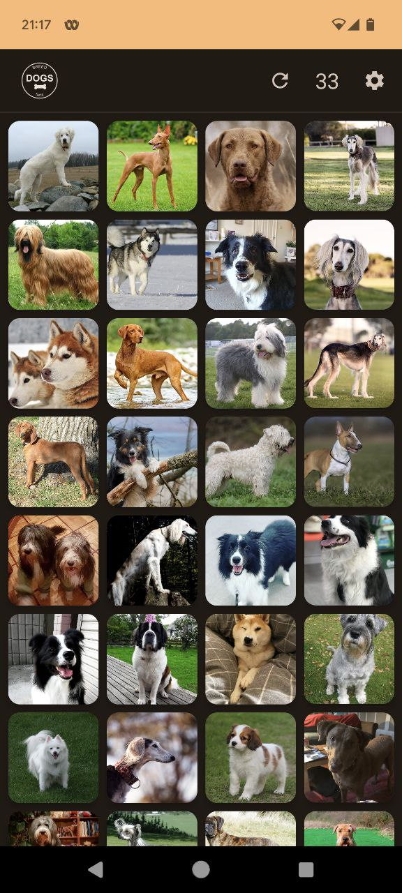
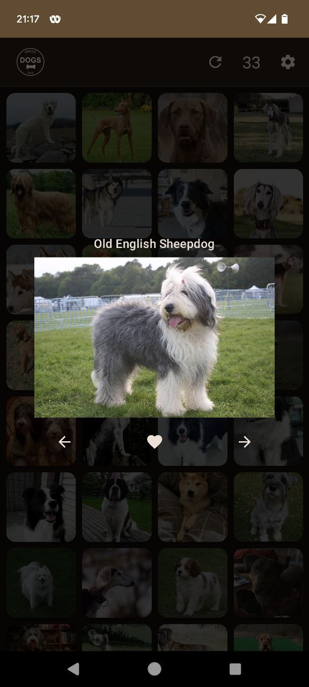

# Dogs - an Android App
> exploring proper navigation and the use of Ktor

This Android app lets you retrieve some dog breed info by making
use of the API: [thedogapi.com](https://www.thedogapi.com/).

Download the latest release: [1.0.0](https://github.com/etnt/Dogs/releases/tag/v1.0.0)

To use, it get your (free) API key [here](https://www.thedogapi.com/)

## Purpose

The purpose with this app was to explore a number of things:

* The use of the Ktor http client
* Proper Navigation
* The use of the ROOM database
* The use of Hilt dependency injection

But one thing lead to another and I also had to learn things like:

* Storing a counter as an Encrypted Shared Preference.
* Storing images, marked as favorites, on local internal storage.
* Create an image gallery with an animated zoom effect.

The app is organized according to the MVI principle, which means:

* The UI observes changes to any data it depends on and re-renders accordingly.
* The UI signals any interaction with the Domain layer via an Intent
which basically is an action telling the Domain layer what the User want to do.
* The Domain layer exist in between the UI and Data layer. It contains the actual
machinery (business logic) that connects the user interactions with the underlying
data model.
* The Data layer deals with anything southbound, i.e network traffic, DB- and file access.

## Screenshots

    
    
    

## Use of Ktor http client

This was taken from the 15:th season of the YT channel `The Android Factory`.

## Navigation

Was developed with the help of the Github Copilot.

## Room DB

By watching the "Beginner Guide for Room" episode from the YT channel of Philipp Lackner and
"ROOM Database - #1 Create Database Schema" from YT channel by Stevdza-San.

## Using Hilt

Again, by watching the 15:th season of the YT channel `The Android Factory` and with help from the Copilot.
